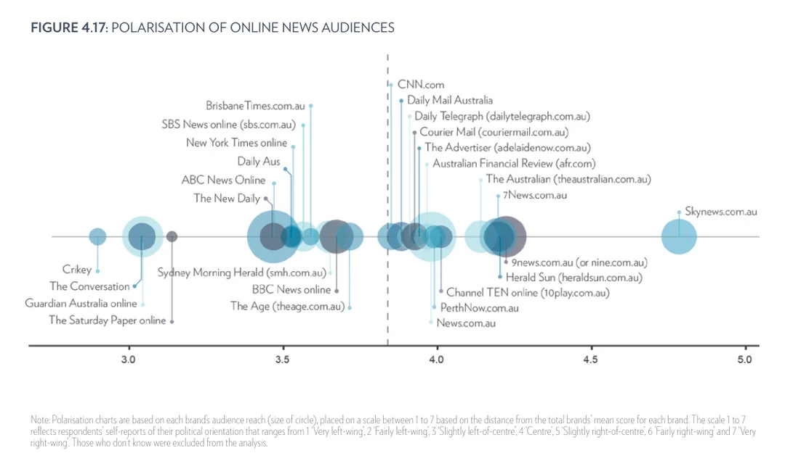

## Connect with me ##
#### Pinker.yao@canberra.edu.au

## Researcher 
#### Technical Skills 
- Quantitative data analysis (SPSS, R)
- Qualitative data analysis (NVivo, ATLAS.ti)
- Systematic literature review
- Infographic design
- Research plan and data collection
- NAATI professional translator
- Fluent in English and Chinese

## Education
- Ph.D., Communication | The University of Canberra (_Present_)								       		
- Master of Communication	| The University of Canberra (_December 2020_)	 			        		
- Bachelor of Broadcasting and Hosting | Tianjin Normal University (_June 2016_)

## Research Projects
### Digital News Report: Australia 
[Publication](https://apo.org.au/sites/default/files/resource-files/2024-06/apo-nid326816_4.pdf)

- Using **SPSS** to conduct statistical data analysis based on the requested theme and topic associated with this report's interest.
- Exploring the Australian and global data to identify the research gap and potential research topic in the news media field.
- Searching literature and analysing the data to write articles based on the research gap found in the raw data.
- Create and maintain the guidebook for the methodology change for each year's report.

### The Rise of Mistrust: Digital platforms and trust in news media
[Publication](https://www.canberra.edu.au/research/faculty-research-centres/nmrc/major-projects/the-rise-of-mistrust)

- Conducting a **systematic literature review** with 4 databases containing more than 1.000 literature.
- Research project management, including data management, meeting schedule, and administration.
- Participating in the experiment design and developing interview guidelines.
- Participating in the longitudinal research design with the Digital News Report data.
- Conducting qualitative data analysis using software **ATLAS,ti**.
- Conducting quantitative data analysis using software **SPSS**.

 

### Who produces the news? – News in Asia 
[Publication](https://www.publicmediaalliance.org/publications/news-in-asia/)

- Collected more than 200 raw data from the media outlets in China and Taiwan through online resources including government documentation, statistics reports, and media releases.
- Conducted overall reports based on the data analysis and generated information. 
- Review all the sources and data used in the report to ensure authenticity and accuracy, as well as translating the Chinese sources to the English version.  
- Generated two thorough reports about the media environment in China and Taiwan.

 
## Publications & Conferences 
- Park, S., Fisher, C., Fletcher, R., Tandoc, E., Dulleck, U., Fulton, J., Stepnik, A., & **Yao, S. P.** (2024). Exploring responses to mainstream news among heavy and non-news users: From high-effort pragmatic scepticism to low effort cynical disengagement. New Media & Society, 27(7), 4143-4163. https://doi.org/10.1177/14614448241234916 (Original work published 2025
- Park, S., McGuinness, K., Fisher, C., Lee, J., McCallum, K., Cai, X., Chatskin, M., Mardjianto, L. & **Yao, P.** (2024). Digital News Report: Australia 2024. Canberra: News and Media Research Centre, University of Canberra. (https://apo.org.au/sites/default/files/resource-files/2024-06/apo-nid326816_4.pdf)
- Park, S., McGuinness, K., Fisher, C., Lee, J., McCallum, K., Cai, X., Chatskin, M., Mardjianto, L. & **Yao, P.** (2023). Digital News Report: Australia 2023. Canberra: News and Media Research Centre, University of Canberra. (https://apo.org.au/sites/default/files/resource-files/2023-06/apo-nid322606_1.pdf)
- Lee, J., McGuinness, K., Park, S., Fisher, C., **Yao, P.**, Chatskin, M., & McCallum, K. (2023). Women and news special report: Gender gaps in news consumption and engagement. Canberra: News and Media Research Centre, University of Canberra. (https://www.canberra.edu.au/research/faculty-research-centres/nmrc/research/gender-special-issue/DNR-Women-and-news-special-report.pdf)
- Park, S., Fisher, C., Fletcher, R., Dulleck, U., Tandoc, E., Fulton, J., Stepnik, A. & **Yao, P.** (2024) “Exploring responses to untrustworthy news among heavy and non-news users: from high-effort pragmatic scepticism to low-effort cynical disengagement”. New Media and Society.(https://doi.org/10.1177/14614448241234916)
- Fisher, C., Park, S., McGuinness, K., Fulton, J. & **Yao, P**. (2024)” I don’t understand it”: Australians’ low interest in politics. and political news. International Journal of Communication 
- Exploring the Link between Trust in News Media and Social Cohesion. Presented at the Australian and New Zealand Communication Association Annual Conference, Victoria University of Wellington (2023)
- Navigating Trust from an Audience Perspective: Exploring the Relationship Between Trust in News and Social Cohesion in Australia's Multicultural Communities. Presented at the International Communication Association Annual Conference, Journalism Division PhD Colloquium (2024)

## Teaching Experience
- **Course Convener  - Academic writing; Mass Media & International Relationship**  
  Global Learning program at Hubei University, University of Canberra  
  Semester 1 2025

- **Course Convener - Managing Marketing Communication (11641)**  
  Faculty of Art and Design, University of Canberra  
 Semester 2 2024
  
- **Sessional Tutor - Managing Brand (11097)**  
  Faculty of Art and Design, University of Canberra  
  Winter Semester 2024; Semester 2 2023
  
- **Course Convener  - Critical Thinking; Mass Media & International Relationship**  
  Global Learning program at Hubei University, University of Canberra  
  Semester 1 2024

- **Invited Lecture - Doing Social Research (11637)**  
  Faculty of Art and Design, University of Canberra  
  Unleashing the Power of ATLAS.ti In Qualitative Research.  
  Semester 2 2023

- **Invited Lecture - HDR Peer-to-Peer Learning Session**  
  Faculty of Art and Design, University of Canberra  
  The Systematic Literature Review: What Do You Need to Know to Get Started?  
  Semester 2 2022

- **Private Tutor - Chinese Proficiency Test (HSK)**  
  Canberra/Online  
  April 2019 - January 2022

## Industry Experience
**Social Media & Marketing Manager @ Canberra HarkHark Pty. Ltd. (_October/2018 - April/2020_)**
- Developed multimedia marketing content such as blog posts, promotional videos and commercial advertisements on most popular social media platforms (e.g., Facebook, Instagram, YouTube, WeChat Official Account & etc.)
- Proven record of developing and executing several marketing campaigns, resulting in a wide range of exposure and engagement with 6,000+ local followers.
- Liaised corporations with more than 100 local businesses, and created quality photography and written content for these businesses to boost their delivery volume on the HarkHark Canberra APP.
- Closely monitored the businesses’ performances on the HarkHark Canberra APP, conducted monthly analysis reports reflecting their marketing data; followed by evaluating and suggesting the businesses about their space of improvements.

**Broadcast Journalist @ China Beijing TV Life Channel (_July/2016- October /2017_)**
- Conducted research, gathered information from multiple sources and presented results.
- Coordinated with producers and on-air talent to create program content, new ideas and segments.
- Planned video shootings in the studio and remotely by managing production through all stages to completion.
- Responded to emergencies and breaking news stories with a strong sense of urgency, at any hour.
