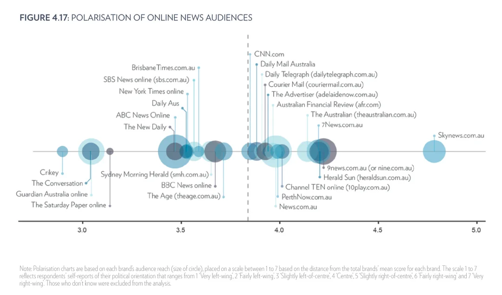
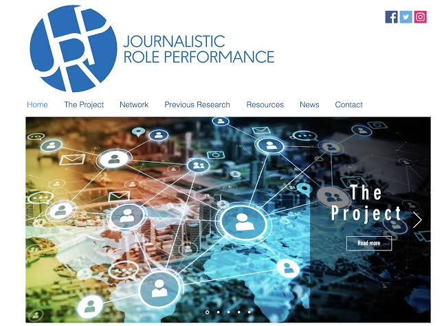

<nav class="profile-nav" aria-label="Profile sections">
  <a href="#profile">Profile</a>
  <a href="#phd-research">PhD Research</a>
  <a href="#research-projects">Research Projects</a>
  <a href="#publications">Publications</a>
  <a href="#selected-conference-presentations">Conferences</a>
  <a href="#teaching-and-research-mentoring">Teaching</a>
  <a href="#academic-leadership-and-service">Service</a>
  <a href="#industry-experience">Industry</a>
</nav>

## Profile

I am a PhD candidate and Research Associate at the News and Media Research Centre, University of Canberra. My research examines how multicultural and multilingual communities navigate complex news environments and how news use and trust shape belonging, settlement, civic participation and social cohesion.

My doctoral research focuses on trust across the multiple news systems used by multicultural Australians. My wider research encompasses journalism, communication infrastructure, multicultural communication, media trust and multicultural audiences.

Before entering academia, I worked as a broadcast journalist at Beijing Television. My combined experience in journalism, multilingual research, university teaching and professional translation informs an interdisciplinary research program focused on news, trust and communication in culturally diverse societies.

  <a href="mailto:Pinker.Yao@canberra.edu.au">Email</a>
  <a href="https://orcid.org/0000-0002-4999-5665">ORCID</a>
  <a href="https://diversenewstrust.com/">PhD Project</a>

## Connect with me

Pinker.Yao@canberra.edu.au

## Research Expertise and Methods

- Quantitative data analysis (SPSS, R)
- Qualitative data analysis (NVivo, ATLAS.ti)
- Mixed-methods research design
- Survey design and analysis
- Qualitative interviewing and thematic analysis
- Systematic literature review
- Data visualisation and infographic design
- Research design and data collection
- Cross-national comparative research
- Cross-cultural and multilingual research
- Research translation for academic, policy and public audiences
- NAATI-certified English-to-Chinese translator
- Fluent in English and Mandarin Chinese

## Education
- PhD, Communication | University of Canberra (_February 2022–present; expected submission early 2027_)
- Master of Communication | University of Canberra (_December 2020_)
- Bachelor of Broadcasting and Hosting | Tianjin Normal University (_June 2016_)

## PhD Research

### Trust in News and Multicultural Social Cohesion

My doctoral research examines how multicultural Australians navigate and evaluate English-language Australian news, community-language news and news from their countries or regions of origin. It investigates how trust develops across these overlapping news systems and how news use connects with settlement, belonging, political efficacy and civic participation. By moving beyond the assumption that audiences inhabit a single national media system, the project develops a more culturally responsive account of news trust and communication infrastructure in multicultural Australia.

The project draws on:

- An original survey of 231 participants from multicultural communities in Australia.
- Nineteen in-depth interviews with participants from diverse cultural and migration backgrounds.
- Communication infrastructure theory, uses and gratifications, and acculturation theory.
- Integrated quantitative and qualitative analysis.

## Research Projects
### Digital News Report: Australia
[2024 Report](https://apo.org.au/sites/default/files/resource-files/2024-06/apo-nid326816_4.pdf) · [2023 Report](https://apo.org.au/sites/default/files/resource-files/2023-06/apo-nid322606_1.pdf)

The *Digital News Report* is an annual international research program led by the Reuters Institute for the Study of Journalism. The 2024 study surveyed nearly 100,000 news consumers across 47 markets, with the News and Media Research Centre producing the Australian report and analysis. I contributed to the 2023 and 2024 Australian editions, supporting national and comparative evidence on news consumption, trust, avoidance and engagement.

- Used **SPSS** to conduct statistical analysis of Australian and international survey data for report themes and related research questions.
- Explored Australian and global data to identify research gaps and emerging topics in news and audience research.
- Reviewed literature and analysed data to support articles arising from patterns identified in the datasets.
- Created and maintained a guidebook documenting annual changes to the international survey methodology and dataset.

### The Rise of Mistrust: Digital platforms and trust in news media
[Project website](https://www.canberra.edu.au/uc-research/faculty-research-centres/nmrc/major-projects/the-rise-of-mistrust)

Funded by the Australian Research Council through Discovery Project DP210100157 (2021–2024), this multi-method and cross-national project examined how digital platforms reshape the mechanisms through which trust and mistrust influence audience behaviour. Its program combined longitudinal analysis, a cross-country experiment and qualitative research to generate evidence relevant to journalism practice and media policy. As a doctoral scholarship recipient and research team member embedded in the project, I contributed to its evidence review, research design, data analysis, project coordination and collaborative publications.

- Conducted a **systematic literature review** across four databases, screening a corpus of more than 1,000 records.
- Supported research project management, including data management, meeting coordination and research administration.
- Contributed to experimental research design and the development of interview protocols.
- Contributed to longitudinal research design using Digital News Report data.
- Conducted qualitative data analysis using **ATLAS.ti**.
- Conducted quantitative data analysis using **SPSS**.
- Contributed to collaborative article development on news trust, mistrust and audience disengagement.

 

### Journalistic Role Performance Project (JRP)

[Visit the Journalistic Role Performance Project website](https://www.journalisticperformance.org/)

**Researcher, Australian team | January 2026–present**

The Journalistic Role Performance Project is a large-scale international collaboration hosted by the Pontificia Universidad Católica de Valparaíso, with participating teams supported by national research councils, universities and local organisations. Building on comparative research across 37 countries in its previous wave, the third wave (2025–2029) examines how professional journalistic roles are reflected in current-affairs news across television, radio, print and online platforms in diverse media systems.

- Systematically collect, sample and code approximately 50 Australian news items each month using the project’s shared analytical framework.
- Contribute to the construction of a comparable Australian dataset.
- Support international comparative analysis of how journalistic roles, newsroom contexts and media systems shape news practice.

### Who Produces the News? – News in Asia
[Publication](https://www.publicmediaalliance.org/publications/news-in-asia/)

This research formed part of *News in Asia*, a region-wide report produced through the Judith Neilson Institute for Journalism and Ideas’ Asian Stories project. The wider initiative brought together researchers and journalism experts to examine news production, consumption, media freedom, digital transformation and public diplomacy across one of the world’s most diverse media regions. I contributed to the project’s comparative mapping of news production by developing evidence on China and Taiwan.

- Collected more than 200 data points concerning media outlets in China and Taiwan from government documentation, statistical reports, media releases and other online sources.
- Analysed the evidence and contributed to overall reporting on the two media environments.
- Reviewed sources and data to ensure authenticity and accuracy and translated Chinese-language sources into English.
- Generated two detailed reports about the media environments in China and Taiwan.

 
## Publications

### Peer-reviewed journal articles

- Fisher, C., Park, S., McGuinness, K., Fulton, J., & **Yao, S.** (2024). [“I don’t understand it”: Australians’ low interest in politics and political news](https://ijoc.org/index.php/ijoc/article/view/22521). *International Journal of Communication, 18*, 3836–3854.
- Park, S., Fisher, C., Tandoc, E., Dulleck, U., **Yao, S. P.**, & Lukamto, W. (2025). [The relationship between news trust, mistrust and audience disengagement](https://doi.org/10.1177/14648849241299775). *Journalism, 26*(11), 2285–2304.
- Park, S., Fisher, C., Fletcher, R., Tandoc, E., Dulleck, U., Fulton, J., Stepnik, A., & **Yao, S. P.** (2025). [Exploring responses to mainstream news among heavy and non-news users: From high-effort pragmatic scepticism to low-effort cynical disengagement](https://doi.org/10.1177/14614448241234916). *New Media & Society, 27*(7), 4143–4163.

### Research and policy reports

- Park, S., Fulton, J., Fujita, M., McGuinness, K., Nolan, D. J., Lee, J. Y., Bianchi-Howden, S., Atkinson, S., **Yao, S. P.**, & Kim, W.-K. C. (2026). [*Synthesis and Priorities—News Futures: Media Policy Roundtable 2026*](https://doi.org/10.60836/db83-vn82). University of Canberra.
- Park, S., McGuinness, K., Fisher, C., Lee, J., McCallum, K., Cai, X., Chatskin, M., Mardjianto, L., & **Yao, P.** (2024). [*Digital News Report: Australia 2024*](https://apo.org.au/sites/default/files/resource-files/2024-06/apo-nid326816_4.pdf). News and Media Research Centre, University of Canberra.
- Park, S., McGuinness, K., Fisher, C., Lee, J., McCallum, K., Cai, X., Chatskin, M., Mardjianto, L., & **Yao, P.** (2023). [*Digital News Report: Australia 2023*](https://apo.org.au/sites/default/files/resource-files/2023-06/apo-nid322606_1.pdf). News and Media Research Centre, University of Canberra.
- Lee, J., McGuinness, K., Park, S., Fisher, C., **Yao, P.**, Chatskin, M., & McCallum, K. (2023). [*Women and News: Gender Gaps in News Consumption and Engagement*](https://www.canberra.edu.au/research/faculty-research-centres/nmrc/research/gender-special-issue/DNR-Women-and-news-special-report.pdf). News and Media Research Centre, University of Canberra.

## Selected Conference Presentations

### 2026

- Cai, X., & **Yao, S. P.** “Framing and Rhetoric in Diasporic Media Coverage of Australia’s 2025 Federal Election.” Paper accepted for presentation at the 76th Annual Conference of the International Communication Association.
- **Yao, S. P.** “Multicultural Australian Audiences: Which News to Trust, and Where to Belong?” Paper presented at the ICA 2026 preconference, *Practicing Trust: Media, Machines and Methods*.
- **Yao, S. P.** “Trust Beyond a Single News System: Communication Infrastructures and Belonging Among Multicultural Australians.” Paper accepted for presentation at the Australian and Aotearoa New Zealand Communication Association Conference.
- Panel convenor and proposer, “Storytelling at the Margins: Community Engagement, Access, and Building Trust in Times of Disruption,” Australian and Aotearoa New Zealand Communication Association Conference.

### 2025

- **Yao, S. P.** “Alternative Media and Sense of Belonging: News Consumption and Trust among Multicultural Communities in Australia.” Paper presented at the International Association for Media and Communication Research Conference, Nanyang Technological University, Singapore, 13–17 July 2025.
- **Yao, S. P.** “Understanding the Role of News Media in Shaping Belonging among Australia’s Multicultural Communities: A Focus on News Consumption and Trust.” Paper presented at the Australian and Aotearoa New Zealand Communication Association Conference, University of the Sunshine Coast.

### 2024

- Fisher, C., Park, S., Barnes, R., & **Yao, S. P.** “Is There a Difference between Political News Avoidance and General News Avoidance?” Co-authored paper presented at the Australian and New Zealand Communication Association Conference.
- **Yao, S. P.** “Navigating Trust from an Audience Perspective: Exploring the Relationship between Trust in News and Social Cohesion in Australia’s Multicultural Communities.” Paper presented at the International Communication Association Annual Conference, Journalism Studies Division PhD Colloquium.

### 2023

- **Yao, S. P.** “Exploring the Link between Trust in News Media and Social Cohesion.” Paper presented at the Australian and New Zealand Communication Association Conference, Victoria University of Wellington, New Zealand.
 

## Teaching and Research Mentoring

I teach and convene units across media, communication, marketing, audience research and industry-engaged learning at the University of Canberra. My teaching connects research evidence with authentic communication problems, guiding students from problem definition and audience or stakeholder analysis through to strategy, implementation and evaluation. Across coursework and industry projects, I use staged feedback and project mentoring to support students in developing their own intellectual and professional agendas.

### Unit convening and teaching

#### Industry Project (11635), University of Canberra

**Unit Convener, 2025–present**

This industry-collaborative unit brings student teams together with external partners to address authentic organisational and communication challenges. I coordinate engagement between students and industry stakeholders and guide teams through project scoping, stakeholder analysis, evidence collection, strategy development, review and the presentation of an implementable plan. The role combines unit leadership with sustained project mentoring, including iterative feedback on proposals, engagement plans and professional deliverables.

#### Managing Marketing Communication (11642), University of Canberra

**Unit Convener, Semester 2, 2024 and Semester 2, 2026**

This unit focuses on communication management within organisational structures and processes of change. Drawing on leadership theory and stakeholder analysis, I guide students to diagnose communication challenges, identify the needs and influence of internal and external stakeholders, and develop evidence-based communication and engagement plans that can be applied within changing organisations.

#### Digital Marketing (11424), Canberra Business School, University of Canberra

**Sessional Tutor, Semester 2, 2025; Unit Convener, Semester 2, 2026**

This unit examines digital strategy, audience acquisition and behaviour, content development, platform selection and performance measurement. I lead the teaching and assessment design, using applied business cases to connect digital funnels and the acquisition–behaviour–conversion framework with relevant performance indicators and campaign decisions.

#### Audience Research and Insight, University of Canberra

**Curriculum development, 2026**

I contributed to the design of a new postgraduate unit focused on defining audience problems, evaluating qualitative and quantitative methods, integrating evidence and translating audience insight into strategy, key performance indicators and ethical professional recommendations.

#### Managing Brand (11097), University of Canberra

**Sessional Tutor, four teaching periods across 2023–2025, including Winter Semester**

Facilitated case-based learning on brand identity, positioning, stakeholder meaning and strategic brand management, and provided developmental feedback on students’ application of theory to contemporary organisations.

#### Negotiation and Sales Management (11332), University of Canberra

**Unit Convener**

I convene this unit’s teaching and assessment in negotiation preparation, sales management and client relationships. Through practical scenarios and structured discussion, I guide students to connect negotiation and sales concepts with professional decision-making, stakeholder communication and relationship development.

#### University of Canberra Global Learning Program, Hubei University

Each Global Learning semester involved convening and teaching two separate units in a cross-cultural higher-education environment:

- **Academic Writing**, Semester 1 and Semester 2, 2025 — guided students in developing their own academic agendas, refining researchable questions, constructing evidence-based arguments, working critically with sources and communicating an independent scholarly position.
- **Mass Media and International Relations**, Semester 1, 2025 — examined relationships among media systems, international affairs, political communication and representation through comparative cases and structured discussion.
- **Intercultural Communication**, Semester 2, 2025 — introduced theories and applied problems concerning culture, identity and communication, with activities developing reflective and context-sensitive communication practice.
- **Critical Thinking**, Semester 1, 2024 — developed students’ ability to evaluate claims and evidence, recognise assumptions, compare perspectives and construct reasoned arguments.
- **Mass Media and International Relations**, Semester 1, 2024 — connected media theory with international news, representation and global political communication.

### Student project supervision and research mentoring

- Supervise student teams in Industry Project (11635) as they work with external partners to define organisational problems and develop implementable plans.
- Guide project development from scoping and stakeholder engagement through evidence gathering, strategic development, progress review and final professional presentation.
- Mentor students across audience research, digital marketing and strategic communication projects, helping them translate research and analysis into feasible recommendations.
- Support Academic Writing students in developing individual scholarly agendas, researchable questions and independent evidence-based arguments.

### Invited research training

- **Invited lecture, Doing Social Research (11637)**, University of Canberra — “Unleashing the Power of ATLAS.ti in Qualitative Research,” Semester 2, 2023.
- **HDR Peer-to-Peer Learning Session**, University of Canberra — “The Systematic Literature Review: What Do You Need to Know to Get Started?”, Semester 2, 2022.

### Earlier teaching

- **Private Tutor, Chinese Proficiency Test (HSK)**, Canberra/online, April 2019–January 2022.

## Academic Leadership and Service

### HDR Representative, News and Media Research Centre, University of Canberra

- Represent higher degree by research candidates in Centre-level discussion and planning.
- Communicate HDR priorities, opportunities and concerns between candidates and the Centre.
- Organised an AANZCA–News and Media Research Centre event, coordinating academic and HDR participation and supporting research exchange and community building.
- Support opportunities for HDR engagement, professional development and research visibility.

### Conference and research community contribution

- Participant and presenter, ICA 2026 preconference, “Practicing Trust: Media, Machines and Methods.”
- Contributed to organising the News Futures: Media Policy Roundtable 2026 discussion and supporting the exchange among researchers, policymakers and media-sector participants that informed the roundtable report.
- Panel convenor and proposer, “Storytelling at the Margins: Community Engagement, Access, and Building Trust in Times of Disruption,” AANZCA 2026.
- Contribute to national and international research exchange through conference presentations, panel development, peer review and research-event organisation.

### Peer review

- Ad hoc reviewer for *Journalism Practice*.
- Reviewer of conference submissions for the International Communication Association.

## Awards and Funding

- University of Canberra doctoral scholarship associated with the Australian Research Council Discovery Project *The Rise of Mistrust: Digital Platforms and Trust in News Media*.
- Higher Degree by Research dissemination funding, University of Canberra: AUD 1,000 annually, 2022–2025, supporting presentations at national and international conferences.

## Industry Experience

### Social Media and Marketing Manager

**Canberra HarkHark Pty Ltd**

*October 2018–April 2020*

- Developed multimedia communication materials across Facebook, Instagram, YouTube and WeChat, including articles, promotional videos and commercial campaigns.
- Planned and delivered campaigns for a local audience of more than 6,000 followers, using engagement data to evaluate performance and refine communication strategies.
- Managed relationships with more than 100 local businesses and produced tailored written and visual content to support their communication and commercial objectives.
- Analysed monthly platform and campaign performance and translated the findings into practical recommendations for participating businesses.

### Broadcast Journalist

**Beijing Television Life Channel**

*July 2016–October 2017*

- Researched, developed and produced broadcast stories using interviews, documentary sources and field reporting.
- Collaborated with producers, presenters and production teams to develop programs, segments and story concepts.
- Coordinated studio and location-based production from initial research and planning through filming and delivery.
- Reported on breaking and time-sensitive stories in a deadline-driven newsroom environment.
